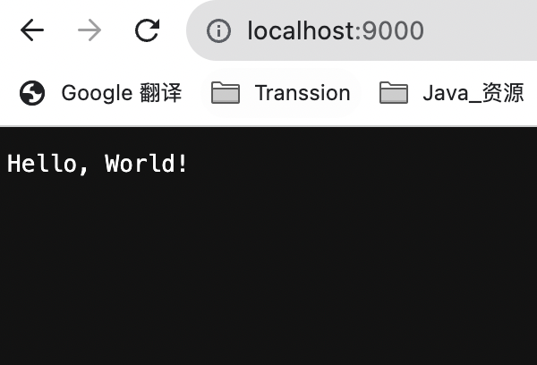

## Build Helloworld.go




```go
package main

import (
    "fmt"
    "log"
    "net/http"
)

func handler(w http.ResponseWriter, r *http.Request) {
    log.Println("received request from", r.RemoteAddr, r.URL.Path[1:])
    var welcome = r.URL.Path[1:]
    if len(welcome) == 0 {
        welcome = "World"
    }
    fmt.Fprintf(w, "Hello, %s! ", welcome)
}

func main() {
    http.HandleFunc("/", handler)
    log.Println("starting server on port 9000")
    log.Fatal(http.ListenAndServe(":9000", nil))
}

```


## Make Dockerfile

```dockerfile
FROM golang:latest

# 将工作目录设置为 /app
WORKDIR /app

# 将当前目录下的所有内容复制到 /app 下
COPY . /app

# 允许宿主机访问容器的 8000 端口
EXPOSE 9000

# 设置容器进程为：go run helloworld.go
CMD go run helloworld.go

```


## Build Image


```shell
docker build -t helloworld:1.0 .
    
```


## Start container

```shell
docker run -d --name myhello -p 9000:9000 helloworld:1.0
```

